# EVInnovation Website
View the live project here [EVInnovation](https://shida18719.github.io/Electric-Vehicles/)

The EVInnovation website is designed to be responsive and accessible on a range of devices, making it easy to navigate for visitors to find reliable information pertaining to Electric Vehicle news, insights, update and new innovations.

This website is targeted towards drivers, individuals, businesses and curious minds who loves to learn about electric vehicles.

 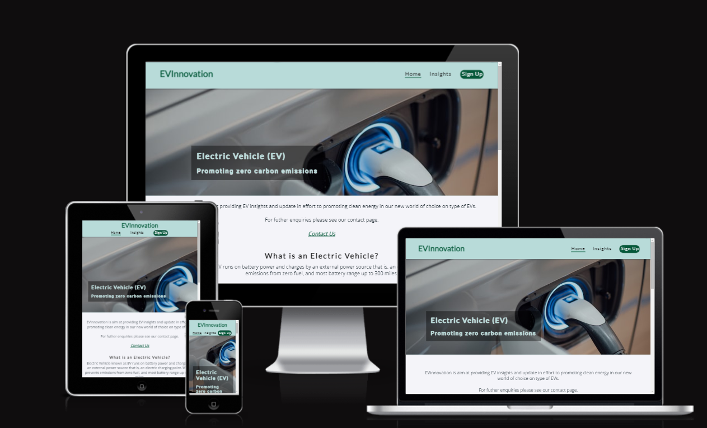                                         

***

## Initial Discussion 

This site will be targeted to drivers, anyone considering driving a vehicle, companies looking to become climate positive, such as changing fleets to environmentally friendly. 

Evinnovation is aim at providing EV news, insights, updates and EV industry in effort to promot zero emmisions

Electric Vehicle is an inevitable innovation that will eventually be adapted by the masses. With many people trying to be climate positive and various government initiatives trying to encourage individuals and businesses to play their part in order to meet the net zero target. 

Various Government agencies and research bodies have confined that electric vehicles are more climate positive than petrol and diesel vehicles. However, there seems to be barriers to the adoption of electric vehicle such as not enough charge points, range issues and convenience. 

This website looks at some of those barriers and innovations in the work to address these. Statistics are showing increase sales in electric vehicle and car manufactures are continuously working to make this an attractive proposition. 
This website aims to educate and demystify some of the myths surrounding early adoption. At very least the website aim to make electric vehicle a viable option and something to consider now or the near future. 

# User Stories

### Client Goals: 

+ To create a user friendly website where the contents are easily accessible. 

+ To create a website that can be viewed on a range of device monitor sizes. 

+ To educate the user on electric vehicle and how it can help the environment. 

+ To preview new innovations in electric vehicle technology with the aim of keeping the interested in the topic. 

+ To create a mailing whereby users can be kept informed and in so do guaranteeing future web traffic.  

### First Time Visitor Goal: 

+ I want to learn more about electric vehicle and how it can help me become climate positive.  

+ I want to be persuading to consider electric vehicle as a viable option for my next car purchase or lease. 

+ I want the website to demystify any doubts I am having about electric vehicle.   

+ I want to navigate the website with ease, finding the contents interesting, educative and helpful. 

+ I want to be able to be kept informed on new developments via the website, the social media contacts and the mailing list. 

### Returning Visitor Goals: 

+ I want to be able to see updates on innovations and timeframe for availability. 

+ I want to read about government incentives to make it a viable option for me. 

+ I want to be able to read about positive measureable effect of electric vehicle and at some point join the crusade. 

+ I want the website to arouse my interest and in so doing allow further investigation on the topic. 

### Frequent Visitor Goals:
  
+ I want to be able to lease or purchase an electric vehicle as a result of the information provided on the website. 

## Features
***
## Existing Features
***
+ ### Navigation bar

  * Featured on all three pages, the full responsive navigation bar includes links to the Logo, Home page, insights and Sign Up page and is identical in each page to allow user easy navigation.
  * This section will allow the user to easily navigate from page to page across all devices without having to revert back to the previous page via the ‘back’ button.
  * The navigation bar is in a centered cloumn on small screen sizes

  
  

+ ### The landing page

  * The landing page includes an image of an electric vehicle charging with text overlay that .
  * This section introduces the user to the goal of the website.

     * ####  Landing page image

   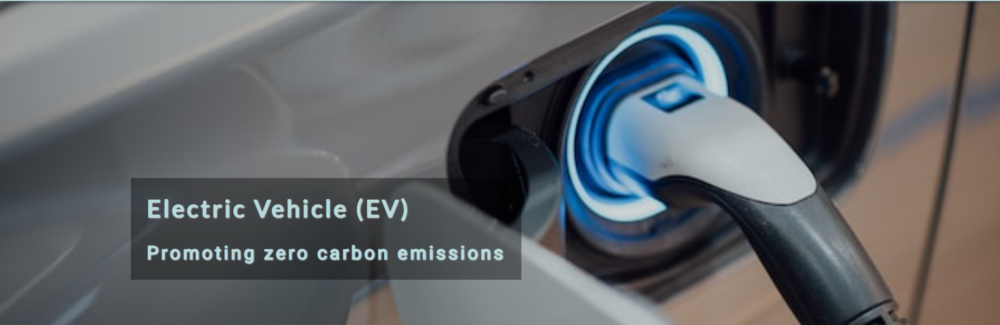
    
+ ### About Section
     
   * The about section introduces the user to the objectives and purpose of the website.
   * The section made a brief description about EV and the acronym of electric vehicle (EV).
   * This section has a contact us clickable botton that takes user to the sign up page.
   * The section introduces the user to types of electric vehicle and why it is a better choice in a short video of two minutes, thirthy seconds by Energy Source.
   * The section encourages user to be climate positive.  
        

    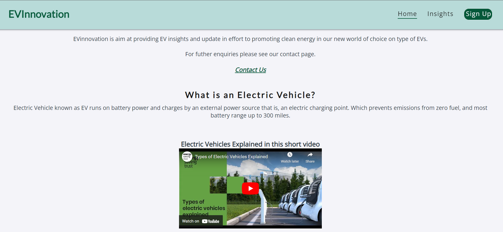

+  ###  Check List Content Section

   * The user can see the interactive menu, a check list of the insights page content. The list has a transition effect when hover.  
   * User can be taken to insights page when any of the menu is clicked.  

    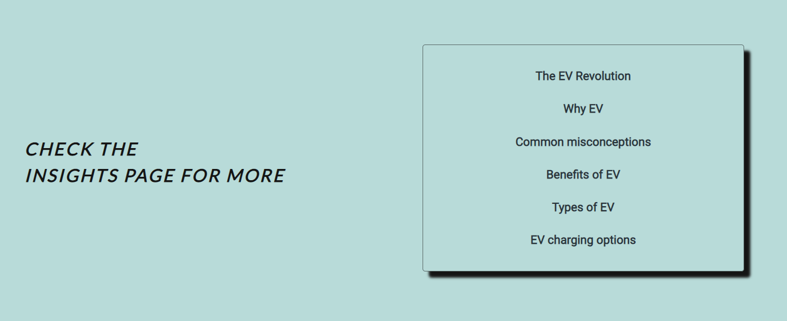

    [Small Check List Image](./READMEimages/sm-checklist-section.png)

+ ### Footer

    * The footer is featured on the pages of the website. It includes links to the relevant social media sites to the center right and the logo on the left side. The links will open to a new tab to allow easy navigation for the user.
   * The logo and the social media links is displayed in vertically aligned order on small screen sizes.
   * The footer is valuable to the user as they can interact and keep connected with others with similar interest via social media.
   * The user can stay up to date with news and insights on the EV industry.
   * The footer is also a channel to create and promote awareness about EVInnovation to more users. 

    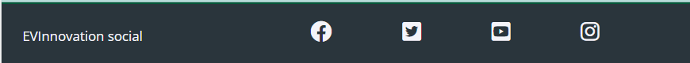

    [Small Footer Image](./READMEimages/sm-footer-image.png)

+  ### The Insights Page

    * The insight page includes an image of an electric vehicle and a charger at the top part of the page, a with text overlay that promotes the future of electric vehicle to the user.
     * This section provides the user with detailed information surrounding electric vehicle.
     * The user can read and learn about benefits and types of electric vehicle.
     * The user can see the sales chart showing the accelerated growth over the past few years. 
     * The user can learn about the charging options available.
     * The insights page can help the user change their perspectives towards electric vehicle, why it's important to the environment.
     * The page can enlightened user about the incentives available to drivers. 
     * The page is displayed in rows and columns layout for big screen size, and displayed vertically on small screen sizes.
     * The insights page can be responsive on all screen size.
     * There is a transition effect on some parts of the insight page, from the why Ev to the types of EV. 

    [Insights Page Large Screen Display](./READMEimages/insights-page-image.png)

    [Insights Page Small Screen Display](./READMEimages/insights-page-small-img.png)

    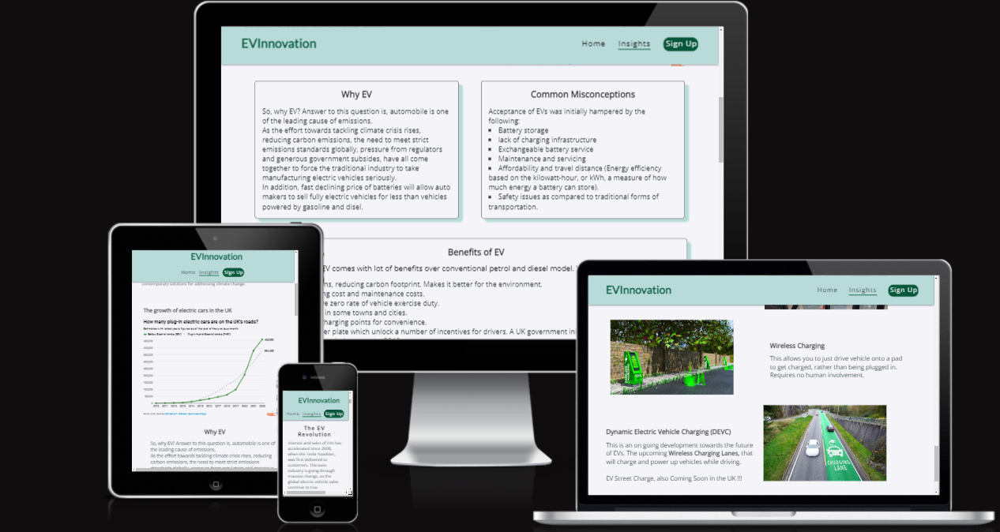

+   ###  The Sign Up Page

      * This page will allow the user to get signed up to EVInnovation to join the mailing list. The user will be able to recieve news and updates on relevant information on EV and the industry.
      * The form contains fields for the users name and email address where user will be asked to submit their full name and email address.
      * The user submits the form using the subscribe button. Users must fill in the name and email to be able to submit the form. If they don't a tooltip will guide them to fill in any information they have missed.
      * The user is free to unsubscribe if they are no longer interested.

      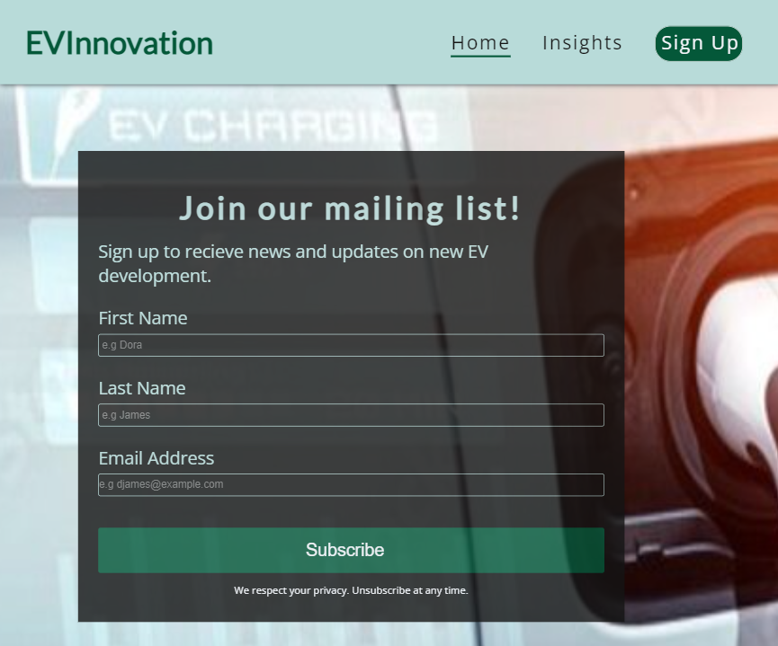    

## Future Features
   * To use JavaScript to add a sandwich menu navigation bar formobile screen size.
   * Add google map to different electric vehicle charging location.
   * Add direct links of Electric vehicle dealers charging area.
   * A link to government legislation.
   * A link to carbon footprint monitor websites. An example is ecolgi.com.
   * EV models comparison and recommendation page.

# Typography and Color Scheme

## Typography

+ Google Fonts was used for the following:

+ Lato is used for headings on the site, with a secondary of serif font.

+ Open sans is used for the body text on the site, with a secondary sans-serif font.

+ Roboto is used for the overlay-text, a sans-serif font.

+ Merriweather is used for the list on the home page, with a secondary of Roboto and sans-serif.

## Color Scheme

+ EVInnovation website uses color palette of nature. The color palette was created using the [Coolors](https://coolors.co/141414-2a353c-b8dbd9-f4f4f9-04724d) website.
+ The colors used are #141414(Eerie Black), #2A353C(Gunmetal), #B8DBD9(Powder Blue), #F4F4F9(Ghost White) and #04724D(Dark Spring Green)

 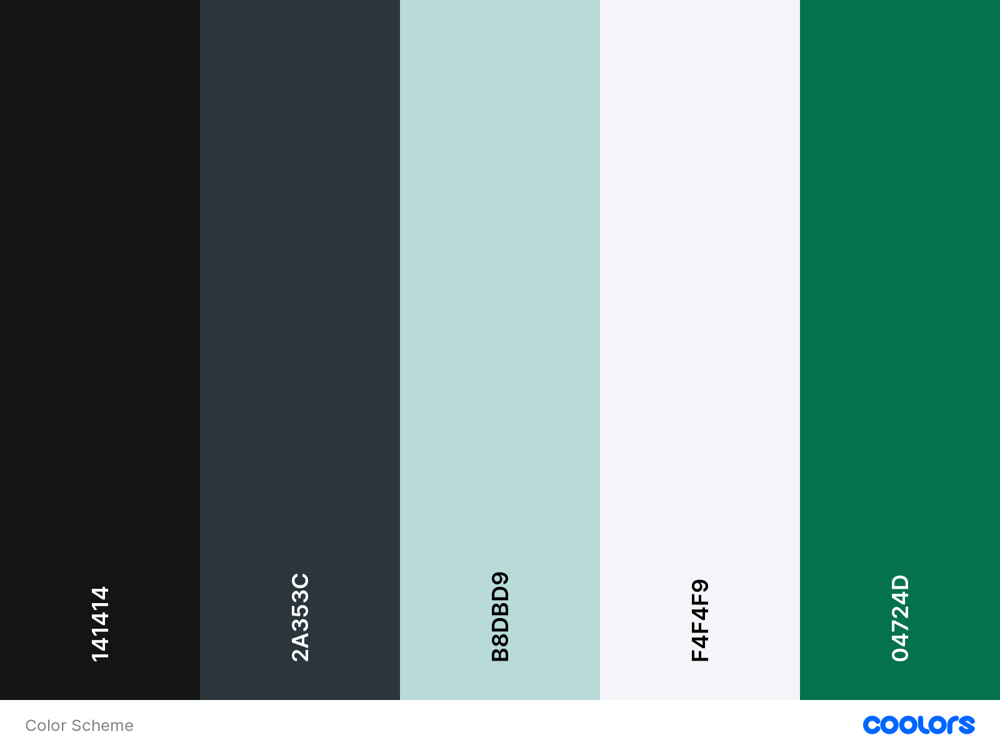

## Wireframes

 [Desktop Home Page Wireframe](./READMEimages/desktop-homepage-wireframe.png)

 [Desktop Insights page Wireframe](./READMEimages/desktop-insightspage-wireframe.png)

 [Desktop Sign Up Page Wireframe](./READMEimages/desktop-sign-uppage-wireframe.png)

 [Medium Screen Size Home Page Wireframe](./READMEimages/medium-screensize-homepage-wireframe.png)

 [Medium Screen Size Insights Page Wireframe](./READMEimages/medium-screensize-insightspage-wireframe.png)

 [Mobile Screen Size Home Page Wireframe](./READMEimages/mobile-screensize-homepage-wireframe.png)

 [Mobile Screen size Insights Page Wireframe](./READMEimages/insightspage-mobile-screensize-wireframe.png)

 [Mobile Screen Size Sign Up Page Wireframe](./READMEimages/mobile-screensize-signuppage-wireframe.png)

 [First Design Wireframe](./READMEimages/first-design-wireframe(2).png)

# Technology

## Technologies Used

* HTML 
* CSS

## Programs Used

* Git - Was used for version control, the Gitpod terminal to commit and push to GitHub.

* [GitHub](https://github.com/) - Was used to store the project code and display the project in GitHub Pages.

* Balsamiq - is a mockup software that was used to create the wireframes.

* [TinyPNG](https://tinypng.com/) - Was used for compressing images to a smaller size.

* [Coolors](https://coolors.co/) - Was used for creating a pallet of the colors used.

* [Am I Responsive?](https://ui.dev/amiresponsive) - Was used for showing how responsive design looks on different screen sizes.

* [Font Awesome](https://fontawesome.com/) - Was used to add icons to the social links in the footer.

* Google Dev Tools- Where used to test and troubleshoot the webpage as well as fix problems with responsive design and styling.

* [Google Fonts](https://fonts.google.com/) - Where used to import the fonts used on the website.

* [WebAIM](https://webaim.org/resources/contrastchecker/)- Was used for checking color contrast for accessibility.

* [BIRME](https://www.birme.net/) - Was used to covert image into Webp format.

# Testing

## Troubleshooting & peer code review

Testing was ongoing throughout the build of this website. I used Google Chrome developer tools while building to pinpoint and troubleshoot any issues as I went along and also asked other on the slack channel to have a look and give me their opinion.

The following issues were raised during my mid project meeting with my mentor:

* The insights page images and overlay text were not very responsive on smaller screen size. I have used pixels and padding on the overlay text. My mentor advice I should think about the units I was using for sizing and measurement to make the site responsive. Examples, is using percentages for fuidity on containers that I would like to scale, compare to using pixels. And the use of so much padding. That has now been fixed with the use of percentages, padding and margin.   

* The charger and the dynamic image always clinging to either the left or right side when resized for responsiveness. This was resolved after taking off margin-left and margin-right used when styling.

Some of the suggestion raised on slack channel:

* MiaRasmussen_5P, advice that I change the font size used across different screen sizes to improve readability.
* I had issues with some text content running in vertical height when resizes for smaller screen. This was resolved with padding set to zero.

## Code validation

The [W3C HTML](https://validator.w3.org/) and [W3C CSS](https://jigsaw.w3.org/css-validator/) validator were used to validate this project.

* HTML 
  + [HTML Validator For Home Page](./READMEimages/homepage-html-validation.png)

   + [HTML Validator For Insights Page](./READMEimages/insightspage-html-validator.png)

   + [HTML Validator For Sign Up Page](./READMEimages/signup-page-html-validator.png)

* CSS

  + [CSS Validator For style.css file](./READMEimages/css-style-validator.png)

## Lighthouse

I used Lighthouse on Google Chrome Developer Tools to test for the performance, accessibility, best practices and SEO of the website.

* Home page lighthouse testing - mobile ~ desktop

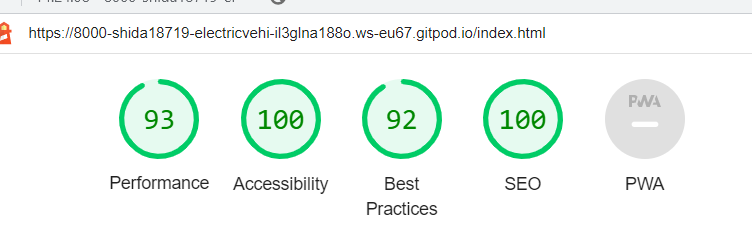

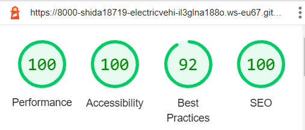

* Insights Page lighthouse testing - mobile ~ desktop

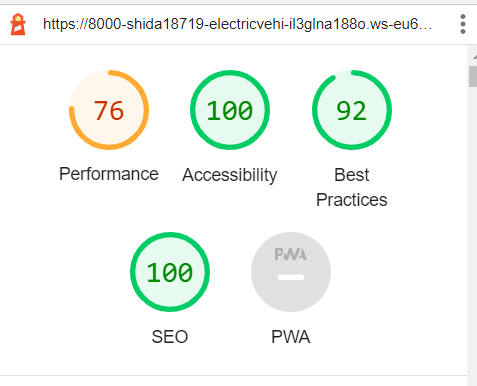

Suggestions:

  * Serve images in next-gen formats. Lighthouse suggests using image formats of WebP & AVIF to improve compression and lead to faster downloads and less data consumption. I have converted the insights page background image to webp format using Birme. Also re-sized the image to improve load time.

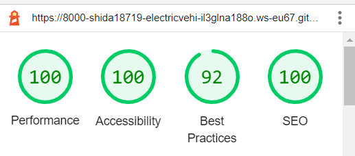

* Sign Up page lighthouse testing - mobile ~ desktop 

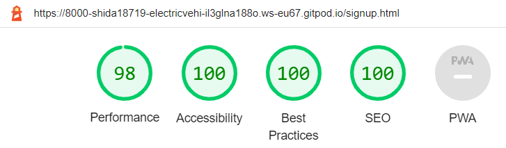

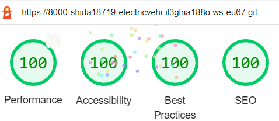

## Test case

  ## Testing Users Stories

+ As a visiting user, I want to be able to navigate easily across the website to find more information.
A user can navigate all three pages from home page header, it is at the top of  all the pages. Also a contact us link to the sign up page and the interactive check list at the bottom part of home page links to the insights page.

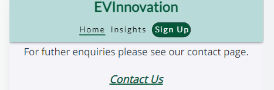

+ As a visiting user, I want to learn more about electric vehicle and how it can help me become climate positive. 

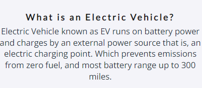

+ As a visiting user, I will like to join the mailing list for new update.
   * I want to be kept informed on new developments via the website.
     The sign up page provides a form that users can fill in their names and email address, then click on the sbscribe button to join the mailing list.

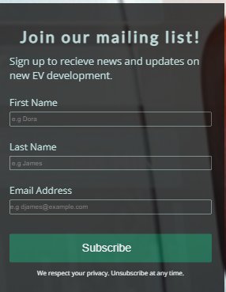

## Fixed bugs
 * Heading and navigation bar not properly aligned on small screen size. Which was hidding part of the sign up button away. This doesn't make for a good user experience as the sign up boutton is one of the Call To Action of the website. This was resolve by taking out the margin left that was inherited from the media query above it.

 * Some issue with image not displaying on the browser, but would display in the editor. After several attempt of fixing the file path, I raised the issue on slack, I was advice by Suzzy_Bee to drag the images folder into the asset folder, it worked firstime. However, same issue occured again. Chris_Williams 5P helped look into it and suggested, the image size was too large. This was fixed by compressing the image using Tinypng.

 * Text overlay not responsive, the overlay box will slide rather than resize to fit. This was fixed using percentages to position the overlay.

## Known Bugs

* The insights page jumps or swirlve some times when  it's pushed. Few suggestions pointed at removing unused codes. But this hasn't really worked.

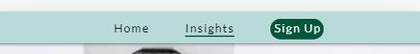
* I discovered there is an openning and closing HTML from the chart that shows up within mine when testing and debbuging on Google chrome dev tool.

 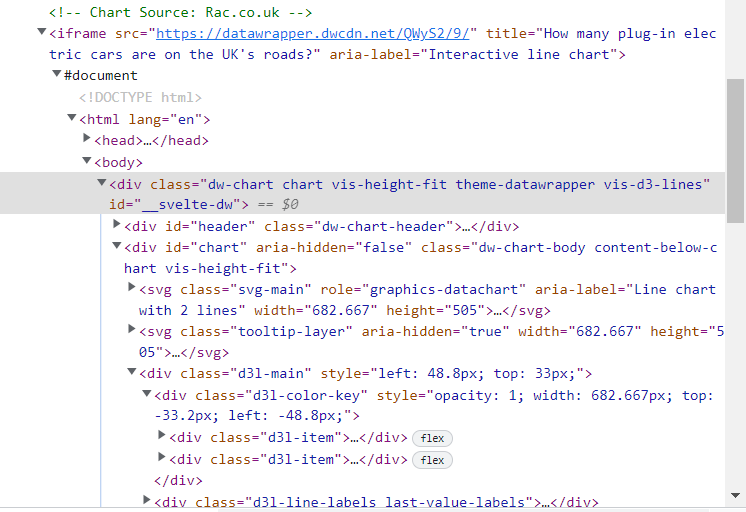

* A scroll bar on the side of the chart after removing the "no scroll" attribute from HTML as this was displaying error after the HTML validator test. I raised this on slack, and I was advised to use the "overflow hidden" attribute instead, but this hasn't yet being resolved.

* Issue with not able to display backgroung=d image on image Apple products. I raised this on slack, the suggest I got from Jo_ci was that "It seems some Apple devices don't handle the shorthand" correctly. I used the background-image syntax in the media query. Image displayed on ipad, but not on smaller screen size.

## Full Testing

I performed differnt testing on my website using differnt browsers (google chrome, safari, mozilla firefox and MicroSoft Edge) and the devices, such as (iPhone 12, motorola and Apple ipad).

I also went through each page using google chrome developer tools to ensure that they responsive on all different screen sizes.

  * Test the link on every page. Each worked as expected, and any links leading to external pages opened correctly in a seperate browser tab.

  * The sign up form work correctly. As I tried submitting the form with just one input after the other, leaving the the other input empty, with the push of the subscribe button.  I was prompted to fill out the remaining field.

  * 

# Deployment 

This site was deployed to GitHub pages via Gitpod. The steps to deploy are as follows:

* Gitpod

    + Log into GitHub.
    + Create a repository
    + Click on the green Gitpod button at the top of the page, this loads the editor.
    + Click on the button that says More Actions.
    + Click Open in Browser.
    + Right click the big box on the left with your repository name.
    + Click new file.
    + Then create an index.html file.
    + Go to the top of the index file, and typein "!" and enter. This will make a start template.
    + Make a basic structure for your index page.
    + Click on terminal at the bottom of the page to start your commit message.
    + type 'git add .'
    + Then for your first commit type in 'git commit -m "Initial commit".
    + The type 'git push'.
    + Your code has now been pushed and saved onto your GitHub repository.

* GitHub pages

   + Log into GitHub.
   + Find the repository for this project Electric Vehicles.
   + Go to the settings link.
   + Click on the Pages link on the left side of the navigation bar.
   + In the Source section, choose main from the drop down select branch menu.
   + Click Save. Your live GitHub pages site is now deployed and the URL shown at the top of the page.

   # Credits

    ## Code Used

   [W3Schools](https://www.w3schools.com/css/default.asp)

   ## Content
   
    + All text content have been writen by me.
    + The icons in the footer were taken from [Font Awesome](https://fontawesome.com/v5/search)

    ## Media
       
    + Background image on the home page and the charger image on the insights page was taken from [Unsplash](https://unsplash.com/s/photos/electric-car)
    + Video on the home page was taken from [Energy Saving Trust](https://energysavingtrust.org.uk/) 
    + Backgroud image, wireless and the dynamicimage on the Insights page were taken from [Adobe Stock](https://stock.adobe.com/uk/)
    + The chart used on insights page was taken from [Rac](https://www.rac.co.uk/drive/electric-cars/)
  
  ## Acknowledgments

  I would like to acknowledge the following people who helped me along the way in completing my first milestone project:

  + My family, for their uderstanding.
  + The slack community, for always being there.
  + [MiaRasmussen_5P](https://github.com/MiaRasmussen05), for her great support and time looking into the project all through.
  + [Chris_Williams_5P](https://github.com/Chr15w1986), for the time spent figuring out why the images on the site are not displayed on the browser.
  + My mentor jubril_mentor, for helping me understand where I was going wrong
  + [Okurut_5p](https://github.com/kedi1991/), for is advice and suggestions during this projects. 
  + [Kera Cudmore/Kera Cudmore_lead](https://github.com/kera-cudmore) for doing a 'Creating your first README webinar' it helped me so incredibly much.

